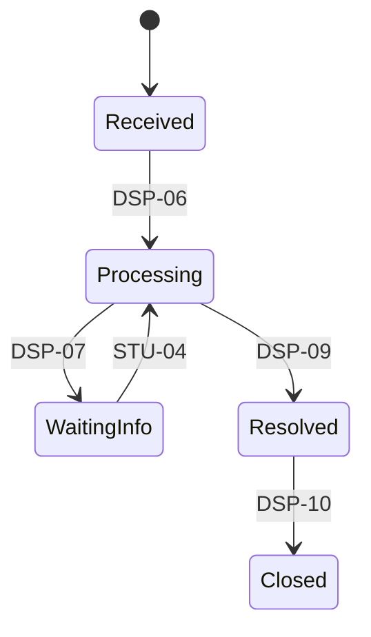

# Vòng đời yêu cầu

Năm trạng thái là thiết kế đề xuất trong phạm vi xử lý của proposal, cần xác nhận OQ-02.

Received = Đã tiếp nhận; Processing = Đang xử lý; WaitingInfo = Chờ bổ sung; Resolved = Đã giải quyết; Closed = Đã đóng. Phân loại/phân công/đặt hạn/cập nhật không tự đổi trạng thái. Phản hồi kết quả không tự mở lại hoặc tự đóng.
