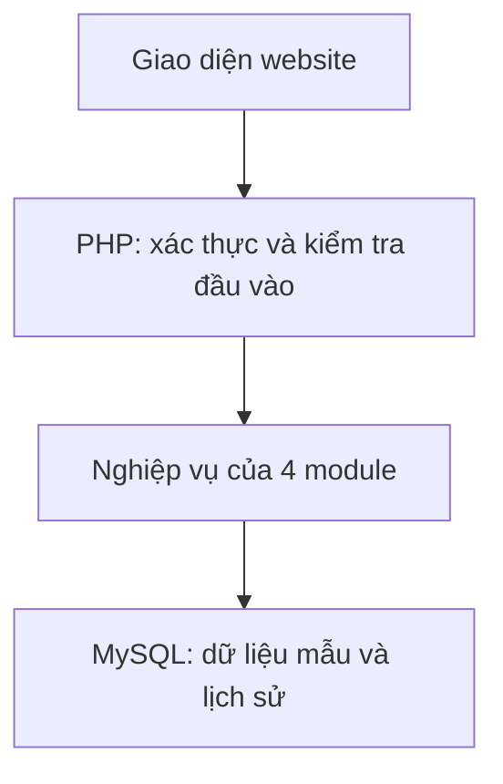

# Kiến trúc đề xuất

Controller kiểm tra đầu vào, authorization service kiểm tra vai trò/đối tượng, nghiệp vụ kiểm tra trạng thái/phiên bản, repository dùng query tham số hóa. View encode output. Nghiệp vụ ghi và history cùng transaction; báo cáo đọc snapshot nhất quán. Phân thư mục theo 4 module không đồng nghĩa 4 ứng dụng độc lập.
